# Bizment — Social Network Multimediale Cloud-Native

## 1. Introduzione

### 1.1 Obiettivo del Progetto
Bizment è un social network multimediale full-stack che consente agli utenti di registrarsi, pubblicare contenuti visivi (immagini e GIF), votare, commentare e visitare i profili di altri utenti. Il progetto nasce come applicazione monolitica locale ed è stato interamente migrato verso un'architettura **cloud-native** basata su servizi **PaaS (Platform as a Service)** di Microsoft Azure.

### 1.2 Stack Tecnologico
- **Frontend**: React 19 con Vite 6, React Router 7, React Bootstrap 2, MSAL React 5.
- **Backend**: NestJS su Node.js 22, TypeORM, Passport.js, Multer.
- **Database**: PostgreSQL 16 (Azure Flexible Server).
- **Caching**: Redis (Azure Cache for Redis).
- **Storage**: Azure Blob Storage.
- **Identità**: Microsoft Entra ID (OAuth 2.0 / OIDC).
- **Gateway**: Azure API Management (Tier Developer).
- **Segreti**: Azure Key Vault.
- **Monitoraggio**: Application Insights (Frontend e Backend).
- **CI/CD**: GitHub Actions.

---

## 2. Architettura Cloud

### 2.1 Panoramica
L'architettura segue il modello **Three-Tier** (Presentazione, Logica, Dati) con l'aggiunta di un API Gateway e di un layer di caching. Tutti i servizi sono ospitati nella regione **Sweden Central** e condividono un unico **App Service Plan** denominato `ASP-Bizment-97c3` (Tier **Basic B1**).

### 2.2 Inventario delle Risorse Azure

| Nome Risorsa | Tipo | Regione |
| :--- | :--- | :--- |
| `bizment-frontend` | App Service (Web App) | Sweden Central |
| `bizment-backend` | App Service (Web App) | Sweden Central |
| `bizment-apimanagement` | API Management (Developer) | Sweden Central |
| `bizment-db` | Database PostgreSQL Flexible Server | Sweden Central |
| `bizmentstorage` | Storage Account | Sweden Central |
| `bizment-cache` | Azure Cache for Redis | Sweden Central |
| `bizment-keyvault` | Key Vault | Sweden Central |
| `bizment-frontend` | Application Insights | Sweden Central |
| `bizment-backend` | Application Insights | Sweden Central |
| `ASP-Bizment-97c3` | App Service Plan (Basic B1) | Sweden Central |

### 2.3 Diagramma Architetturale

```mermaid
graph TD
    subgraph Client
        A["Browser / React SPA"]
    end

    subgraph Gateway
        B["Azure API Management<br/>(bizment-apimanagement)"]
    end

    subgraph Compute
        C["Backend NestJS<br/>(bizment-backend)"]
        D["Frontend Express<br/>(bizment-frontend)"]
    end

    subgraph Identity
        E["Microsoft Entra ID"]
    end

    subgraph Persistence
        F["PostgreSQL<br/>(bizment-db)"]
        G["Blob Storage<br/>(bizmentstorage)"]
        H["Redis Cache<br/>(bizment-cache)"]
    end

    subgraph Security
        I["Key Vault<br/>(bizment-keyvault)"]
    end

    subgraph Monitoring
        J["Application Insights"]
    end

    A -->|HTTPS| D
    A -->|API REST| B
    B -->|IP Filtering| C
    C -->|JWT Validation| E
    C -->|TypeORM / SSL| F
    C -->|SDK Storage Blob| G
    C -->|TLS :6380| H
    I -.->|Key Vault References| C
    J -.->|Telemetria| C
    J -.->|Telemetria| D
```

---

## 3. Frontend (React + Vite)
Il frontend è una **Single Page Application (SPA)** sviluppata in React 19 con Vite 6. L'interfaccia utente è costruita con **React Bootstrap** e la navigazione è gestita da **React Router v7**.

Originariamente previsto su *Azure Static Web Apps*, il frontend è stato ospitato su un **Azure App Service** dedicato (`bizment-frontend`) a causa di limitazioni della sottoscrizione *Azure for Students*. Per gestire correttamente il routing SPA su App Service, è stato implementato un micro-server Express che serve i file statici e redirige tutte le rotte a `index.html`.

Le variabili d'ambiente del frontend (`VITE_*`) sono configurazioni pubbliche iniettate durante la build tramite GitHub Secrets e **non** transitano per il Key Vault.

---

## 4. Backend (NestJS)
Il backend è costruito con **NestJS** e segue un'architettura modulare con moduli dedicati per ogni dominio: Auth, Post, Comment, Vote, User, Tag e Common (servizi trasversali come Storage e interceptor).

All'avvio, tutte le variabili d'ambiente vengono validate tramite schema **Joi**, garantendo che connessioni a PostgreSQL, Redis, Blob Storage e Entra ID siano correttamente configurate.

Il backend è ospitato sull'App Service `bizment-backend` con runtime **Node.js 22 LTS (Linux)** e ascolta sulla porta dinamica `process.env.PORT`. Le variabili d'ambiente sensibili puntano al Key Vault tramite Key Vault References.

---

## 5. Autenticazione (Microsoft Entra ID)
L'autenticazione è stata migrata da un sistema locale (email/password con bcrypt e JWT custom) a **Microsoft Entra ID**, delegando l'intero ciclo di vita delle credenziali al provider di identità cloud. Sul portale Azure sono state create due **App Registration**: una per il frontend (SPA con PKCE) e una per il backend (API con scope `access_as_user`).

- **Frontend**: Utilizza `@azure/msal-react` per l'acquisizione silenziosa dei token (`acquireTokenSilent`) prima di ogni chiamata API.
- **Backend**: La `JwtStrategy` utilizza `passport-jwt` con `jwks-rsa` per validare dinamicamente i token tramite le chiavi pubbliche di Microsoft, senza segreti condivisi.
- **Auto-Provisioning**: Al primo login, il backend estrae i claims dal token e crea automaticamente il profilo utente nel database.
- **JwtOptionalAuthGuard**: Guard personalizzato per le rotte ibride (autenticati + ospiti), che restituisce `null` se il token è assente.

---

## 6. API Management e Isolamento di Rete
**Azure API Management** (`bizment-apimanagement`) è il punto di accesso unico per le API. Tutte le chiamate del frontend transitano per `https://bizment-apimanagement.azure-api.net`.

APIM agisce come **Reverse Proxy trasparente**: applica la policy CORS centralizzata in fase inbound e inoltra le richieste (inclusi gli header di autorizzazione) al backend. La Subscription Key è stata disabilitata, in quanto l'autenticazione è gestita dai Guard NestJS.

Per l'isolamento del backend, è stato adottato il **Tier Developer** che fornisce un **VIP statico**. Sull'App Service `bizment-backend` è stata configurata una Access Restriction che accetta traffico unicamente dall'IP di APIM. Qualsiasi accesso diretto restituisce `403 Forbidden`.

---

## 7. Persistenza dei Dati

### 7.1 Azure Database for PostgreSQL
Il database `bizment-db` (Flexible Server, Tier Burstable) gestisce le entità User, Post, Comment, Vote e Tag con relazioni ManyToOne, OneToMany e ManyToMany. Le connessioni sono cifrate con SSL/TLS e il firewall è limitato ai servizi Azure interni. Il backend interagisce tramite **TypeORM** con `autoLoadEntities`.

### 7.2 Azure Blob Storage
I file multimediali sono ospitati nello Storage Account `bizmentstorage` (container `posts-images`). Il backend riceve i file in memoria tramite Multer, li carica su Azure con un nome univoco tramite `@azure/storage-blob` e persiste solo l'URL pubblico nel database. Alla cancellazione di un post, il blob associato viene eliminato automaticamente.

---

## 8. Caching Distribuito (Azure Cache for Redis)
L'istanza `bizment-cache` è connessa tramite **TLS (porta 6380)**. Il backend implementa il pattern **Cache-Aside**:
- **Feed paginato**: TTL 10 minuti (solo per ospiti non autenticati).
- **Post singolo**: TTL 1 ora.
- **Post del giorno**: TTL 24 ore.

La cache viene invalidata ad ogni creazione o eliminazione di un post. Per gestire l'idle timeout di Azure Redis (che chiude le connessioni inattive causando `ECONNRESET`), è stato implementato un error handler passivo che impedisce il crash e permette la riconnessione automatica.

---

## 9. Gestione Segreti (Azure Key Vault)
Tutte le credenziali sensibili (PostgreSQL, Redis, Blob Storage, Entra ID) sono centralizzate in `bizment-keyvault`. L'App Service del backend accede al Vault tramite **System-Assigned Managed Identity** con ruolo *Key Vault Secrets User*. Le variabili d'ambiente sono configurate come **Key Vault References** (`@Microsoft.KeyVault(SecretUri=...)`), iniettate a runtime senza modifiche al codice.

Il frontend non utilizza il Key Vault: le sue variabili (`VITE_*`) sono configurazioni pubbliche scolpite nel JavaScript durante la build.

---

## 10. Monitoraggio (Application Insights)
**Application Insights** è attivo sia per `bizment-frontend` che per `bizment-backend`, raccogliendo log applicativi, metriche di performance e tracciamento delle richieste HTTP.

---

## 11. Pipeline CI/CD (GitHub Actions)
- **Backend** (`develop_bizment-backend.yml`): Push su `develop` → build → deploy su `bizment-backend` tramite Publish Profile.
- **Frontend** (`develop_bizment-frontend.yml`): Push su `develop` → build con iniezione delle variabili Vite tramite GitHub Secrets → deploy su `bizment-frontend` tramite Publish Profile. L'artefatto include i file statici (`dist/`), `server.js`, `package.json` e `package-lock.json`.
